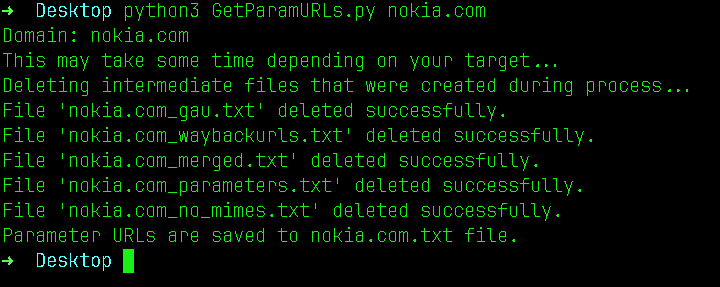

# GetParamURLs

GetParamURLs is a Python-based URL collection and filtering pipeline for bug bounty hunters. It gathers endpoints from historical archives, actively crawls the live target, extracts hidden endpoints from JavaScript files, and outputs a clean, deduplicated list of GET URLs with query parameters — plus a separate file of POST form endpoints — ready to feed directly into a scanner.



## Table of Contents

- [Features](#features)
- [How It Works](#how-it-works)
- [Prerequisites](#prerequisites)
- [Installation](#installation)
- [Usage](#usage)
- [Output Files](#output-files)
- [Contributing](#contributing)
- [License](#license)

---

## Features

- **Historical collection** via `gau` (Wayback, CommonCrawl, OTX, URLScan), `waybackurls`, and `waymore`
- **Active crawling** via `katana` (JS-rendered, follows `fetch()`/XHR calls) and `gospider` (follows `robots.txt` + `sitemap.xml`)
- **JavaScript endpoint extraction** — fetches all linked `.js` files and applies regex patterns for `fetch()`, `axios`, `$.ajax`, XHR `.open()`, and embedded API paths
- **POST form extraction** — katana detects HTML forms with `method="post"` and extracts field names into a separate structured file
- **Scope filtering** — removes URLs outside the target domain before any further processing
- **MIME type filtering** — strips URLs pointing to images, fonts, media, scripts, stylesheets, and other non-interesting static files
- **Smart deduplication** — removes duplicate URLs by endpoint + parameter signature, keeping one representative URL per unique combination regardless of different parameter values
- **Subdomain support** — optional flag to include subdomains in collection
- **Authenticated crawling** — pass a cookie string for scanning behind login walls
- **Configurable crawl depth** — control how deep active crawlers go
- **Intermediate file cleanup** — tmp files deleted automatically unless `--keep-tmp` is set

---

## How It Works

The pipeline runs in three sequential phases:

**Phase 1 — Historical collection**
Queries `gau`, `waybackurls`, and `waymore` for archived URLs. These sources cover Wayback Machine, CommonCrawl, OTX, and URLScan. Fast, no active requests to the target.

**Phase 2 — Active crawling**
`katana` actively spiders the live site, renders JavaScript, and parses `fetch()`/XHR calls to discover endpoints that were never archived. It also detects HTML forms and records their method and input field names. `gospider` adds coverage via `robots.txt` and `sitemap.xml`.

**Phase 3 — JavaScript endpoint extraction**
Collects all `.js` file URLs found during the previous phases, fetches each one, and applies regex patterns to extract API paths, route definitions, and endpoint strings embedded in the code.

After collection, all URLs pass through a filtering pipeline: scope check → query param filter → MIME filter → deduplication.

---

## Prerequisites

### Required

- **Python 3.10+**
- **gau** — `go install github.com/lc/gau/v2/cmd/gau@latest` — [docs](https://github.com/lc/gau)
- **waybackurls** — `go install github.com/tomnomnom/waybackurls@latest` — [docs](https://github.com/tomnomnom/waybackurls)

### Recommended

- **katana** — `go install github.com/projectdiscovery/katana/cmd/katana@latest` — [docs](https://github.com/projectdiscovery/katana)
  Required for active crawling, JS parsing, and POST form extraction. Without it you get historical URLs only.

### Optional

- **gospider** — `go install github.com/jaeles-project/gospider@latest` — [docs](https://github.com/jaeles-project/gospider)
  Adds sitemap and robots.txt coverage.
- **subjs** — `go install github.com/lc/subjs@latest` — [docs](https://github.com/lc/subjs)
  Discovers additional JS files for endpoint extraction.
- **waymore** — `pip install waymore` — [docs](https://github.com/xnl-h4ck3r/waymore)
  More thorough archive source than gau alone.

The script checks for all tools on startup and tells you exactly what's missing and how to install it. Missing optional tools are skipped gracefully — the pipeline still runs with whatever is available.

---

## Installation

1. Clone the repository:
   ```sh
   git clone https://github.com/ShrekBytes/GetParamURLs.git
   ```

2. Change into the directory:
   ```sh
   cd GetParamURLs
   ```

3. Install required Go tools (needs [Go](https://go.dev/doc/install)):
   ```sh
   go install github.com/lc/gau/v2/cmd/gau@latest
   go install github.com/tomnomnom/waybackurls@latest
   go install github.com/projectdiscovery/katana/cmd/katana@latest
   go install github.com/jaeles-project/gospider@latest
   go install github.com/lc/subjs@latest
   ```

4. Install optional Python tool:
   ```sh
   pip install waymore
   ```

---

## Usage

### Basic

```sh
python3 collect.py example.com
```

### Include subdomains

```sh
python3 collect.py example.com --subs
```

### Authenticated target (behind login)

```sh
python3 collect.py example.com --cookie "session=abc123; user=xyz"
```

### Deeper crawl

```sh
python3 collect.py example.com --depth 4
```

### Historical sources only (no active crawling)

```sh
python3 collect.py example.com --no-active --no-js
```

### Keep intermediate files for debugging

```sh
python3 collect.py example.com --keep-tmp
```

### All options

```
positional arguments:
  domain             Target domain (e.g. example.com)

options:
  --subs             Include subdomains in collection
  --depth N          Crawl depth for active crawlers (default: 2)
  --cookie COOKIE    Cookie for authenticated crawling e.g. "session=abc"
  --no-active        Skip active crawling (katana, gospider)
  --no-js            Skip JavaScript endpoint extraction
  --no-historical    Skip historical sources (gau, waybackurls, waymore)
  --keep-tmp         Keep intermediate files for debugging
```

---

## Output Files

| File | Contents | Next step |
|---|---|---|
| `example.com.txt` | Deduplicated GET URLs with query params | Feed into scanner |
| `example.com_post.jsonl` | POST endpoints with parameter names | Manual testing or scanner POST mode |

The domain prefix matches your input argument. Running `collect.py example.com` produces `example.com.txt` and `example.com_post.jsonl`.

The POST endpoints file contains one JSON object per line:
```json
{"url": "https://example.com/login", "method": "POST", "params": ["username", "password", "csrf"], "source": "katana_form"}
{"url": "https://example.com/search", "method": "POST", "params": ["q", "filter"], "source": "katana_form"}
```

### Feeding into the scanner

```sh
python3 collect.py example.com
python3 scanner.py example.com.txt
```

---

## Contributing

Feel free to submit issues or pull requests for suggestions, improvements, or bug reports. Your contributions are appreciated!

---

## License

"License? Nah, who needs those bothersome regulations anyway? Feel free to do whatever you want with this code – use it as a doorstop, launch it into space, or frame it as a modern art masterpiece. Just don't blame me if things get a little wild!"
